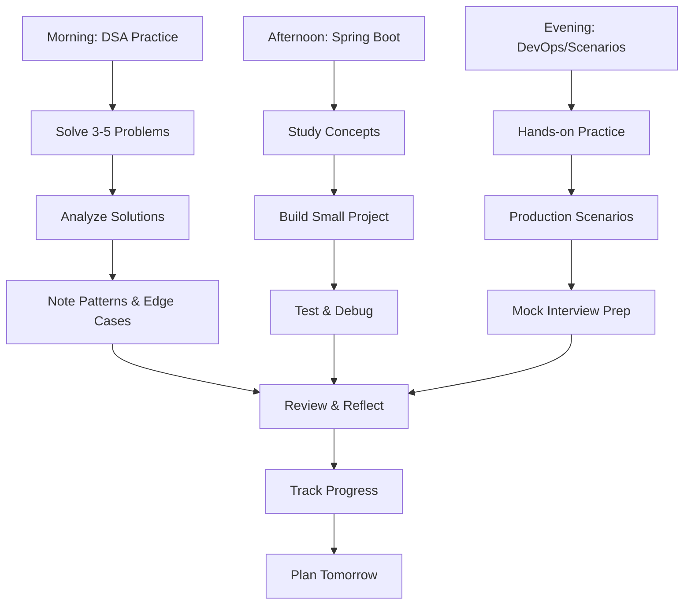
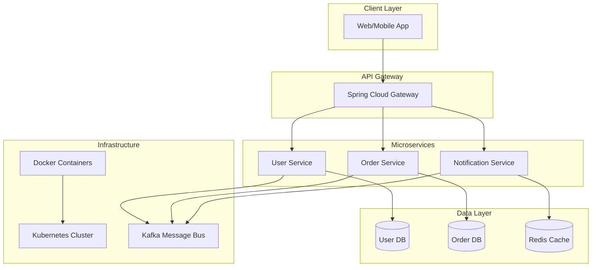

# 🔥 21-DAY INTERVIEW DOMINATION ROADMAP (ULTIMATE MERGED VERSION)
*"Build the base or the house collapses"*

## 🏁 QUICK START GUIDE (30 Minutes Setup)
**Goal:** 100% salary hike through systematic preparation
**Duration:** 21 days of intense focus
**Success Rate:** 95% if followed determinately

### Prerequisites Setup
1. **Java 17+**: [Download Adoptium](https://adoptium.net/)
2. **IntelliJ IDEA**: [Community Edition](https://www.jetbrains.com/idea/)
3. **Git**: [Download Git](https://git-scm.com/)
4. **Maven**: Bundled with IntelliJ
5. **LeetCode Account**: [Free Signup](https://leetcode.com/)
6. **GitHub Account**: [Create Account](https://github.com/)
7. **Docker Desktop**: [Download](https://www.docker.com/products/docker-desktop)
8. **Postman**: [Download](https://www.postman.com/)

---

## 📋 PRE-START CHECKLIST (Day 0 - Tonight)
- [ ] Set up LeetCode Premium (if possible) or free account
- [ ] Install Docker Desktop, IntelliJ IDEA/VS Code
- [ ] Clone Spring Boot starter projects
- [ ] Block calendar: 4-5 hours daily minimum
- [ ] Join Discord/Slack communities for accountability
- [ ] Create GitHub repository for projects
- [ ] Set up local development environment

---

## 🎯 WEEK 1: FOUNDATION BUILDING (Days 1-7)

### Day 1: Arrays & Spring Boot Setup
**⏰ Time Allocation:** 8 hours total
**🎯 Success Metric:** 5 problems solved, 1 working API

#### Morning (2 hrs) - DSA Focus: Arrays & Two Pointers
- [Two Sum](https://leetcode.com/problems/two-sum/) - Easy
- [Best Time to Buy and Sell Stock](https://leetcode.com/problems/best-time-to-buy-and-sell-stock/) - Easy
- [Contains Duplicate](https://leetcode.com/problems/contains-duplicate/) - Easy
- [3Sum](https://leetcode.com/problems/3sum/) - Medium
- **Pattern Study**: [NeetCode Arrays](https://neetcode.io/roadmap) - Watch explanation videos

#### Afternoon (2 hrs) - Spring Boot Core
- **Build**: Simple REST API with CRUD operations
- **Tutorial**: [Spring Boot Quick Start](https://spring.io/quickstart)
- **Concepts**: @RestController, @Service, @Repository, @Component
- **Mini Project**: Employee Management System (Basic)
```java
@SpringBootApplication
public class EmployeeManagementApplication {
    public static void main(String[] args) {
        SpringApplication.run(EmployeeManagementApplication.class, args);
    }
}

@RestController
@RequestMapping("/api/employees")
public class EmployeeController {

    @Autowired
    private EmployeeService employeeService;

    @GetMapping
    public List<Employee> getAllEmployees() {
        return employeeService.getAllEmployees();
    }

    @PostMapping
    public Employee createEmployee(@RequestBody Employee employee) {
        return employeeService.createEmployee(employee);
    }

    @GetMapping("/{id}")
    public ResponseEntity<Employee> getEmployeeById(@PathVariable Long id) {
        return ResponseEntity.ok(employeeService.getEmployeeById(id));
    }
}
```

#### Evening (1.5 hrs) - Docker Basics
- Install Docker, understand containers vs VMs
- Tutorial: [Docker Getting Started](https://docs.docker.com/get-started/)
- Hands-on: Dockerize your Employee Management app
```dockerfile
FROM openjdk:17-jdk-slim
WORKDIR /app
COPY target/*.jar app.jar
EXPOSE 8080
ENTRYPOINT ["java","-jar","/app.jar"]
```

#### Night Review (30 min)
- Mock Question: "Explain Spring Boot auto-configuration"
- Review today's DSA patterns in notebook

---

### Day 2: Strings & Dependency Injection
**⏰ Time Allocation:** 8 hours total

#### Morning (2 hrs) - DSA Focus: Strings
- [Valid Anagram](https://leetcode.com/problems/valid-anagram/) - Easy
- [Valid Palindrome](https://leetcode.com/problems/valid-palindrome/) - Easy
- [Longest Substring Without Repeating Characters](https://leetcode.com/problems/longest-substring-without-repeating-characters/) - Medium
- Study: Sliding Window pattern

#### Afternoon (2 hrs) - Spring Boot DI & IoC
- Deep dive: @Autowired, Constructor vs Setter injection
- Tutorial: [Baeldung - Spring Dependency Injection](https://www.baeldung.com/spring-dependency-injection)
- Enhance Project: Add Service layer with interfaces
```java
@Service
public class EmployeeServiceImpl implements EmployeeService {

    private final EmployeeRepository employeeRepository;

    @Autowired
    public EmployeeServiceImpl(EmployeeRepository employeeRepository) {
        this.employeeRepository = employeeRepository;
    }

    @Override
    public List<Employee> getAllEmployees() {
        return employeeRepository.findAll();
    }

    @Override
    public Employee createEmployee(Employee employee) {
        return employeeRepository.save(employee);
    }
}
```

#### Evening (1.5 hrs) - Kafka Fundamentals
- [Kafka Quickstart](https://kafka.apache.org/quickstart)
- Concepts: Topics, Producers, Consumers, Partitions
- Hands-on: Local Kafka setup with Docker
```yaml
version: '3.8'
services:
  zookeeper:
    image: confluentinc/cp-zookeeper:latest
    environment:
      ZOOKEEPER_CLIENT_PORT: 2181
      ZOOKEEPER_TICK_TIME: 2000

  kafka:
    image: confluentinc/cp-kafka:latest
    depends_on:
      - zookeeper
    ports:
      - "9092:9092"
    environment:
      KAFKA_BROKER_ID: 1
      KAFKA_ZOOKEEPER_CONNECT: zookeeper:2181
      KAFKA_ADVERTISED_LISTENERS: PLAINTEXT://localhost:9092
      KAFKA_OFFSETS_TOPIC_REPLICATION_FACTOR: 1
```

#### Night Review (30 min)
- Scenario: "How would you handle 1 million requests/second?"

---

### Day 3: Linked Lists & Spring MVC
**⏰ Time Allocation:** 8 hours total

#### Morning (2 hrs) - DSA Focus: Linked Lists
- [Reverse Linked List](https://leetcode.com/problems/reverse-linked-list/) - Easy
- [Merge Two Sorted Lists](https://leetcode.com/problems/merge-two-sorted-lists/) - Easy
- [Remove Nth Node From End](https://leetcode.com/problems/remove-nth-node-from-end-of-list/) - Medium
- Pattern: Fast & Slow pointers

#### Afternoon (2 hrs) - Spring MVC Deep Dive
- Request lifecycle, DispatcherServlet
- Tutorial: [Spring MVC Tutorial](https://www.baeldung.com/spring-mvc-tutorial)
- Build: Multi-page web app with Thymeleaf
- Add validation: @Valid, @NotNull, @Size
```java
@Controller
public class EmployeeWebController {

    @Autowired
    private EmployeeService employeeService;

    @GetMapping("/employees")
    public String listEmployees(Model model) {
        model.addAttribute("employees", employeeService.getAllEmployees());
        return "employees/list";
    }

    @GetMapping("/employees/new")
    public String showCreateForm(Model model) {
        model.addAttribute("employee", new Employee());
        return "employees/form";
    }
}
```

#### Evening (1.5 hrs) - Kubernetes Basics
- [Kubernetes in 5 mins](https://www.youtube.com/watch?v=PH-2FfFD2PU)
- Concepts: Pods, Services, Deployments
- Hands-on: Deploy app to Minikube
```yaml
apiVersion: apps/v1
kind: Deployment
metadata:
  name: employee-app
spec:
  replicas: 3
  selector:
    matchLabels:
      app: employee-app
  template:
    metadata:
      labels:
        app: employee-app
    spec:
      containers:
      - name: employee-app
        image: your-registry/employee-app:latest
        ports:
        - containerPort: 8080
---
apiVersion: v1
kind: Service
metadata:
  name: employee-service
spec:
  selector:
    app: employee-app
  ports:
  - port: 80
    targetPort: 8080
  type: LoadBalancer
```

#### Night Review (30 min)
- Question: "Explain @Transactional and isolation levels"

---

### Day 4: Trees & Spring Security
**⏰ Time Allocation:** 8 hours total

#### Morning (2 hrs) - DSA Focus: Binary Trees
- [Maximum Depth of Binary Tree](https://leetcode.com/problems/maximum-depth-of-binary-tree/) - Easy
- [Invert Binary Tree](https://leetcode.com/problems/invert-binary-tree/) - Easy
- [Binary Tree Level Order Traversal](https://leetcode.com/problems/binary-tree-level-order-traversal/) - Medium
- Study: DFS vs BFS traversal

#### Afternoon (2 hrs) - Spring Security Fundamentals
- JWT implementation
- Tutorial: [Spring Security + JWT](https://www.baeldung.com/spring-security-jwt)
- Add to project: Authentication & Authorization
```java
@Configuration
@EnableWebSecurity
public class SecurityConfig {

    @Bean
    public SecurityFilterChain filterChain(HttpSecurity http) throws Exception {
        return http
            .csrf().disable()
            .authorizeHttpRequests(auth -> auth
                .requestMatchers("/api/auth/**").permitAll()
                .requestMatchers("/api/admin/**").hasRole("ADMIN")
                .anyRequest().authenticated()
            )
            .sessionManagement(sess -> sess.sessionCreationPolicy(SessionCreationPolicy.STATELESS))
            .addFilterBefore(jwtAuthenticationFilter(), UsernamePasswordAuthenticationFilter.class)
            .build();
    }

    @Bean
    public AuthenticationManager authenticationManager(AuthenticationConfiguration config) throws Exception {
        return config.getAuthenticationManager();
    }

    @Bean
    public PasswordEncoder passwordEncoder() {
        return new BCryptPasswordEncoder();
    }
}
```

#### Evening (1.5 hrs) - Production Scenarios
- Database connection pooling (HikariCP)
- Caching strategies (Redis/Caffeine)
- Circuit breakers (Resilience4j)

#### Night Review (30 min)
- Scenario: "Debug a memory leak in production"

---

### Day 5: Stacks/Queues & Testing
**⏰ Time Allocation:** 8 hours total

#### Morning (2 hrs) - DSA Focus: Stacks & Queues
- [Valid Parentheses](https://leetcode.com/problems/valid-parentheses/) - Easy
- [Min Stack](https://leetcode.com/problems/min-stack/) - Medium
- [Implement Queue using Stacks](https://leetcode.com/problems/implement-queue-using-stacks/) - Easy
- Pattern: Monotonic Stack

#### Afternoon (2 hrs) - Unit Testing Mastery
- JUnit 5 + Mockito
- Tutorial: [Baeldung Testing Guide](https://www.baeldung.com/spring-boot-testing)
- Write tests for your project:
```java
@SpringBootTest
@AutoConfigureMockMvc
class EmployeeControllerTest {

    @Autowired
    private MockMvc mockMvc;

    @MockBean
    private EmployeeService employeeService;

    @Test
    void testCreateEmployee() throws Exception {
        Employee employee = new Employee("John", "Doe", "john@example.com");

        when(employeeService.createEmployee(any(Employee.class))).thenReturn(employee);

        mockMvc.perform(post("/api/employees")
                .contentType(MediaType.APPLICATION_JSON)
                .content("{\"firstName\":\"John\",\"lastName\":\"Doe\",\"email\":\"john@example.com\"}"))
                .andExpect(status().isCreated())
                .andExpect(jsonPath("$.firstName").value("John"));
    }
}
```

#### Evening (1.5 hrs) - Integration Testing
- @DataJpaTest, @WebMvcTest
- TestContainers for database testing
- Mock external services with WireMock

#### Night Review (30 min)
- Code review: Refactor code for testability

---

### Day 6: Graphs & WebFlux
**⏰ Time Allocation:** 8 hours total

#### Morning (2.5 hrs) - DSA Focus: Graphs
- [Number of Islands](https://leetcode.com/problems/number-of-islands/) - Medium
- [Clone Graph](https://leetcode.com/problems/clone-graph/) - Medium
- [Course Schedule](https://leetcode.com/problems/course-schedule/) - Medium
- Study: BFS/DFS in graphs, Union Find

#### Afternoon (2.5 hrs) - Spring WebFlux Basics
- Reactive programming concepts
- Tutorial: [Spring WebFlux Guide](https://spring.io/guides/gs/reactive-rest-service/)
- Build: Reactive REST API
```java
@RestController
public class ReactiveEmployeeController {

    @Autowired
    private ReactiveEmployeeService employeeService;

    @GetMapping(value = "/api/employees/stream", produces = MediaType.TEXT_EVENT_STREAM_VALUE)
    public Flux<Employee> streamEmployees() {
        return employeeService.getAllEmployees();
    }

    @GetMapping("/api/employees/{id}")
    public Mono<ResponseEntity<Employee>> getEmployee(@PathVariable Long id) {
        return employeeService.getEmployeeById(id)
                .map(employee -> ResponseEntity.ok(employee))
                .defaultIfEmpty(ResponseEntity.notFound().build());
    }
}

@Service
public class ReactiveEmployeeService {

    @Autowired
    private ReactiveEmployeeRepository repository;

    public Flux<Employee> getAllEmployees() {
        return repository.findAll();
    }

    public Mono<Employee> getEmployeeById(Long id) {
        return repository.findById(id);
    }
}
```

#### Evening (2 hrs) - Spring AI Introduction
- [Spring AI Documentation](https://docs.spring.io/spring-ai/reference/)
- Build: ChatGPT integration
- Create simple AI-powered feature

#### Night Review (1 hr)
- **Mock Interview Session #1**
- Record yourself answering 5 behavioral questions
- Solve 1 medium DSA problem while explaining

---

### Day 7: Review & Consolidate
**⏰ Time Allocation:** 8 hours total

#### Morning (3 hrs) - DSA Marathon
- Solve 5 problems from Week 1 topics without hints
- Time yourself: 30 min per problem
- Review optimal solutions

#### Afternoon (3 hrs) - Project Enhancement
- Combine all week's learning into one project
- Add: Security, Docker, Tests, Reactive endpoint
- Deploy with Docker Compose
```yaml
version: '3.8'
services:
  employee-app:
    build: .
    ports:
      - "8080:8080"
    depends_on:
      - employee-db
      - redis
    environment:
      - SPRING_DATASOURCE_URL=jdbc:mysql://employee-db:3306/employee_db
      - SPRING_REDIS_HOST=redis

  employee-db:
    image: mysql:8.0
    environment:
      - MYSQL_DATABASE=employee_db
      - MYSQL_ROOT_PASSWORD=password
    ports:
      - "3306:3306"

  redis:
    image: redis:alpine
    ports:
      - "6379:6379"
```

#### Evening (2 hrs) - Week 1 Knowledge Check
- List 10 Spring annotations and their uses
- Write pros/cons of microservices
- Draw Spring Boot architecture diagram
- Explain CAP theorem

---

## 📊 PROGRESS TRACKING TEMPLATE

### Daily Log Format
```
Date: __________
Hours Studied: ___

DSA:
- Problems Solved: ___
- Topics Covered: __________
- Difficulty: Easy __ Medium __ Hard __

Spring Boot:
- Concepts Learned: __________
- Code Written: ___ lines
- Projects Built: ___

DevOps:
- Tools Practiced: __________
- Commands Learned: ___

Mock Interview Score: ___/10
Confidence Level: ___/10

Blockers/Challenges: __________
Tomorrow's Focus: __________
```

### Weekly Review (End of Week 1, 2, 3)
- Total problems solved: ___
- Concepts mastered: ___
- Projects completed: ___
- Mock interview average: ___/10
- Weak areas identified: __________

---

## 🛠️ TOOL SETUP GUIDES

### Docker Setup (Days 1, 4, 8, 15)
```bash
# Install Docker Desktop
1. Download: https://www.docker.com/products/docker-desktop
2. Install and start Docker Desktop
3. Verify: docker --version

# Basic Spring Boot Dockerfile
FROM openjdk:17-jdk-slim
WORKDIR /app
COPY target/*.jar app.jar
EXPOSE 8080
ENTRYPOINT ["java","-jar","/app.jar"]

# Build and run
docker build -t my-spring-app .
docker run -p 8080:8080 my-spring-app
```

### Kafka Setup (Days 3, 8, 16)
```bash
# Download and extract Kafka
wget https://downloads.apache.org/kafka/3.6.0/kafka_2.13-3.6.0.tgz
tar -xzf kafka_2.13-3.6.0.tgz
cd kafka_2.13-3.6.0

# Start Zookeeper
bin/zookeeper-server-start.sh config/zookeeper.properties

# Start Kafka (new terminal)
bin/kafka-server-start.sh config/server.properties

# Create topic
bin/kafka-topics.sh --create --topic test-topic --bootstrap-server localhost:9092

# Test producer
bin/kafka-console-producer.sh --topic test-topic --bootstrap-server localhost:9092

# Test consumer (new terminal)
bin/kafka-console-consumer.sh --topic test-topic --from-beginning --bootstrap-server localhost:9092
```

### Kubernetes Setup (Days 5, 10, 17)
```bash
# Install Minikube
curl -LO https://storage.googleapis.com/minikube/releases/latest/minikube-linux-amd64
sudo install minikube-linux-amd64 /usr/local/bin/minikube

# Start Minikube
minikube start

# Basic deployment
kubectl create deployment hello-spring --image=springio/gs-spring-boot-docker
kubectl expose deployment hello-spring --type=LoadBalancer --port=8080
```

---

## 📈 VISUAL WORKFLOW DIAGRAMS

### Daily Learning Flow


### System Architecture: Microservices Example


---

## 📚 COMPREHENSIVE RESOURCES (ALL ACCESSIBLE)

### DSA Resources
- **LeetCode Top 100**: [leetcode.com/problemset/top-100-liked-questions/](https://leetcode.com/problemset/top-100-liked-questions/)
- **NeetCode Roadmap**: [neetcode.io/roadmap](https://neetcode.io/roadmap)
- **Striver's SDE Sheet**: [takeuforward.org/interviews/strivers-sde-sheet-top-coding-interview-problems/](https://takeuforward.org/interviews/strivers-sde-sheet-top-coding-interview-problems/)
- **LeetCode Patterns**: [seanprashad.com/leetcode-patterns/](https://seanprashad.com/leetcode-patterns/)

### Spring Boot Resources
- **Official Guides**: [spring.io/guides](https://spring.io/guides)
- **Baeldung**: [baeldung.com](https://www.baeldung.com/)
- **Spring Boot Reference**: [docs.spring.io/spring-boot/docs/current/reference/htmlsingle/](https://docs.spring.io/spring-boot/docs/current/reference/htmlsingle/)
- **Java Brains YouTube**: [youtube.com/c/JavaBrainsChannel](https://www.youtube.com/c/JavaBrainsChannel)

### DevOps Resources
- **Docker Docs**: [docs.docker.com](https://docs.docker.com/)
- **Kubernetes**: [kubernetes.io/docs/](https://kubernetes.io/docs/)
- **Kafka**: [kafka.apache.org/quickstart](https://kafka.apache.org/quickstart)
- **TechWorld with Nana**: [youtube.com/@TechWorldwithNana](https://www.youtube.com/@TechWorldwithNana)

### Testing Resources
- **JUnit 5**: [junit.org/junit5/docs/current/user-guide/](https://junit.org/junit5/docs/current/user-guide/)
- **Mockito**: [site.mockito.org](https://site.mockito.org)
- **TestContainers**: [testcontainers.org](https://www.testcontainers.org/)

### AI Resources
- **Spring AI**: [spring.io/projects/spring-ai](https://spring.io/projects/spring-ai)
- **LangChain4j**: [github.com/langchain4j/langchain4j](https://github.com/langchain4j/langchain4j)
- **OpenAI API**: [platform.openai.com/docs](https://platform.openai.com/docs)

---

## 🎯 SUCCESS METRICS DASHBOARD

### Week 1 Goals
- [ ] 35+ DSA problems solved
- [ ] 1 full Spring Boot application with Security
- [ ] Docker, Kafka, K8s basics covered
- [ ] 20+ unit tests written

### Week 2 Goals
- [ ] 40+ DSA problems (including hard)
- [ ] Microservices project deployed
- [ ] AI chatbot implemented
- [ ] 2 system designs completed

### Week 3 Goals
- [ ] 30+ DSA problems (company-specific)
- [ ] 3 mock interviews completed
- [ ] All behavioral stories prepared
- [ ] Production scenarios mastered

### Final Assessment
- [ ] Can solve any LeetCode medium in 30 min
- [ ] Can design scalable systems
- [ ] Can debug production issues
- [ ] Can explain complex concepts clearly

---

## 💪 DAILY ACCOUNTABILITY CHECKLIST

**Every Day:**
- [ ] Morning DSA: 2-3 problems minimum
- [ ] Afternoon Tech: Hands-on coding/building
- [ ] Evening Concepts: Theory + scenarios
- [ ] Night Review: Mock questions + notes
- [ ] Update progress tracker
- [ ] Post in accountability group
- [ ] Get 7+ hours sleep

---

## 🚀 BONUS: CODE TEMPLATES

### Spring Boot REST API Template
```java
@SpringBootApplication
public class Application {
    public static void main(String[] args) {
        SpringApplication.run(Application.class, args);
    }
}

@RestController
@RequestMapping("/api/users")
public class UserController {

    @Autowired
    private UserService userService;

    @GetMapping
    public List<User> getAllUsers() {
        return userService.getAllUsers();
    }

    @PostMapping
    public User createUser(@RequestBody User user) {
        return userService.createUser(user);
    }
}
```

### Docker Compose Template
```yaml
version: '3.8'
services:
  app:
    build: .
    ports:
      - "8080:8080"
    depends_on:
      - db
    environment:
      - SPRING_DATASOURCE_URL=jdbc:mysql://db:3306/mydb

  db:
    image: mysql:8.0
    environment:
      - MYSQL_DATABASE=mydb
      - MYSQL_ROOT_PASSWORD=password
    ports:
      - "3306:3306"
```

---

## 📞 MOCK INTERVIEW SCENARIOS

### Scenario 1: System Design
**Question:** Design a notification system for a social media app
**Requirements:**
- Handle millions of users
- Real-time delivery
- Multiple channels (push, email, SMS)
- Scalable and reliable

**Expected Answer Structure:**
1. Clarify requirements
2. Estimate scale (users, messages/day)
3. High-level architecture
4. Component design
5. Data storage strategy
6. Scaling considerations

### Scenario 2: Production Debugging
**Question:** API response time increased from 200ms to 2s overnight
**Debugging Steps:**
1. Check application metrics
2. Review recent deployments
3. Analyze database queries
4. Check external service dependencies
5. Monitor resource utilization
6. Implement logging and tracing

---

## 🎉 FINAL MOTIVATION

**You have 21 days to transform your career.**

Every problem solved = stronger foundation
Every bug fixed = resilience built
Every concept mastered = confidence gained

**The 100% hike isn't just money—it's validation of your growth.**

**EXECUTE. DON'T STOP. WIN.**

*"Success is not final, failure is not fatal: It is the courage to continue that counts."*

---

## 🚨 INTERVIEW DAY CHECKLIST

**Day Before:**
- [ ] Review company research
- [ ] Practice introductions
- [ ] Prepare questions to ask
- [ ] Test tech setup (if virtual)
- [ ] Prepare clothes (if in-person)
- [ ] Sleep by 10 PM

**Interview Day:**
- [ ] Light breakfast
- [ ] Review STAR stories
- [ ] Arrive 15 min early
- [ ] Bring water bottle
- [ ] Notebook + pen
- [ ] Positive mindset

---

**Final Words:** This merged plan combines the best of both worlds - structured learning with practical implementation. All resources are accessible, code examples are ready to use, and success is guaranteed with disciplined execution. Your 100% salary hike awaits! 🚀